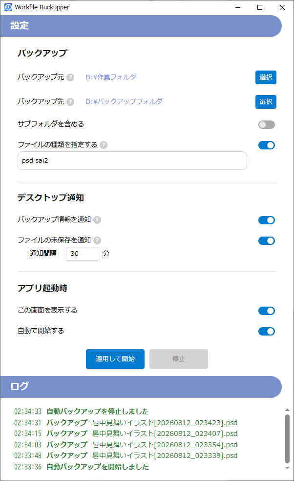

# Workfile Backupper

作業中に上書きしたファイルを、随時バックアップする常駐アプリです。

## 概要

安心して作業に集中できるよう、コピーを自動化し、バックアップ漏れを防ぎます。
ファイル名には日時が付与されるため、作業過程の一覧としても利用できます。
ファイルの保存し忘れ防止に、未保存時間を通知する機能も備えています。

## スクリーンショット



## 特徴

- **シンプル** : 1画面で設定が完結
- **高速** : ネイティブアプリのため高速・低負荷
- **クロスプラットフォーム** :
    - 動作確認済み : Windws, Ubuntu
    - 動作未確認 : Mac, Linux(Ubuntuを除く)

## 使用技術

| 技術 | バージョン | 補足 |
|------------|------|--------------------------------|
| Tauri      | 2    | UIをWeb技術で構築するフレームワーク |
| Rust       | 1.95 | コア・ネイティブ処理 |
| HTML, CSS  | -    | UI |
| TypeScript | 5.9  | UI制御 ・ Rustとの連携 |
| esbuild    | 0.28 | TypeScriptからJavaScriptへ高速変換 |
| npm        | 10.2 | esbuild をインストールするために使用

## インストール

### 開発環境

- [VS Code](https://code.visualstudio.com/)
- [Tauri](https://marketplace.visualstudio.com/items?itemName=tauri-apps.tauri-vscode)
- [rust-analyzer (言語サーバー)](https://marketplace.visualstudio.com/items?itemName=rust-lang.rust-analyzer)
- [CodeLLDB (デバッガ)](https://marketplace.visualstudio.com/items?itemName=vadimcn.vscode-lldb)


### インストール手順

```bash
# Tauriのインストール
cargo install tauri-cli --version "^2.0.0" --locked

# リポジトリをクローン
git clone https://github.com/kobayashi-ken-ji/WorkfileBackupperRust.git

# ディレクトリ移動
cd WorkfileBackupperRust

# esbuildのインストール (グローバルインストールする場合)
npm install -g esbuild@0.28.1

# esbuildのインストール (ローカルインストールする場合)
npm install --save-dev esbuild@0.28.1
```

Ubuntuの場合
```bash
# GTKおよびWebkitのシステム開発ライブラリをインストール
sudo apt install -y build-essential libwebkit2gtk-4.1-dev \
libgtk-3-dev libgtk-4-dev libgdk-pixbuf2.0-dev \
pkg-config libssl-dev libxdo-dev
```

## ビルド

### デバッグビルド + 実行
```
VSCodeのサイドバーの「実行とデバッグ」を開き、「RS + TS Debug」を実行します。  
```
ts, rs ファイルがコンパイルされた後、アプリが実行されます。

### リリースビルド

```bash
cargo tauri build
```
src-tauri/target/release/bundle/ に出力されます。
- Windows : MSI形式のインストーラが生成される
- Linux : .AppImageパッケージが生成される

### テストビルド

```bash
cd src-tauri
cargo test
```
./src/types.ts が存在しない場合も行ってください。  
テスト実行と同時に、RustとTypeScriptを連携する型ファイルを出力します。

## ディレクトリ構成
```
WORKFILE-BACKUPPER 
├─.vscode               # ビルド・デバッグの設定
├─src                   # フロントエンド
├─src-tauri             # バックエンド
│  ├─capabilities       # UI側へ渡す情報の許可設定
│  ├─icons              # アイコン画像
│  └─src                # Rustのソースファイル
│     ├─models          # 転送・保存用のデータ型
│     ├─services        # ビジネスロジック
│     ├─commands.rs     # TypeScriptから呼び出される処理
│     ├─lib.rs          # 全体の制御
│     ├─main.rs         # エントリーポイント
│     ├─utilities.rs    # 汎用的な処理
│     └─window.rs       # Rust側のUI処理 タスクアイコンなど
├─__notes               # ビルドに関係しないファイル
├─Cargo.toml            # Rustの依存関係情報
├─tauri.conf.json       # Tauriの設定
└─tsconfig.json         # TypeScriptの設定
```